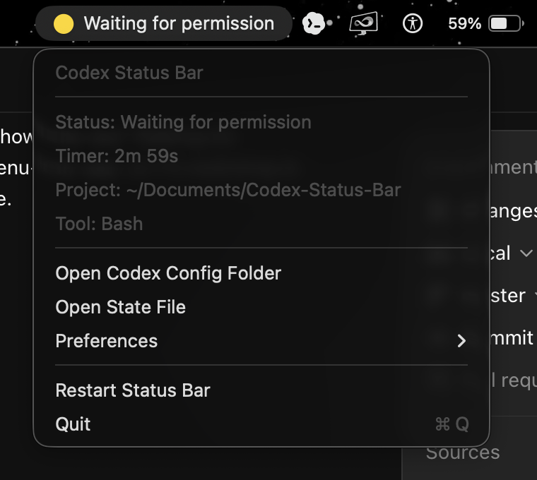

# Codex Status Bar


Codex Status Bar is a native macOS menu-bar app that shows what OpenAI Codex is doing: thinking, running tools, waiting for permission, or finished.

It is local-only, has no dock icon or main window, and makes no network requests. This is an unofficial open-source project and is not affiliated with or endorsed by OpenAI.



## What It Shows

- Idle, thinking, command, edit, read, MCP tool, permission, complete, and error states
- A live elapsed timer for the current turn
- Current project and tool details in the menu
- Native system, green, or minimal-dot icon styles
- Optional completion notifications and configurable auto-idle timing

The integration uses Codex lifecycle hooks in `~/.codex/hooks.json` and the external `notify` command in `~/.codex/config.toml`. Hook commands require review in Codex before they run.

## Requirements

- macOS 12 or later
- OpenAI Codex CLI with lifecycle hooks enabled
- Node.js 18 or later
- Xcode Command Line Tools when building from source

## Install From A Release

1. Download `CodexStatusBar.dmg` from the latest GitHub release.
2. Drag **CodexStatusBar** into **Applications**.
3. Open the app. Its icon and status appear in the macOS menu bar, not in the Codex Extensions list.
4. Restart Codex, run `/hooks`, and trust the new Codex Status Bar hooks.

Release builds are currently ad-hoc signed. On first launch, macOS may require **Control-click > Open**. Developer ID signing and notarization are required before distributing without this warning.

## Build From Source

```bash
./build.sh
cp -R build/CodexStatusBar.app /Applications/
open /Applications/CodexStatusBar.app
```

On first launch, the app installs its scripts under `~/.codex/statusbar/hooks/`, merges its entries into `~/.codex/hooks.json`, and adds its `notify` command when no notifier is already configured.

After the first launch:

1. Restart Codex.
2. Run `/hooks`.
3. Review and trust the Codex Status Bar hooks.
4. Start a new Codex turn.

To install the integration manually:

```bash
node hooks/install.js
```

The installer is idempotent. Before its first edit, it preserves existing files as `config.toml.bak-codex-status-bar` and `hooks.json.bak-codex-status-bar`. It never replaces an existing `notify` command; completion still works through the `Stop` hook in that case.

## DMG

```bash
./build.sh --dmg
```

This creates `build/CodexStatusBar.dmg`. Set `SIGN_IDENTITY` to a Developer ID Application certificate and notarize the result for public distribution:

```bash
SIGN_IDENTITY="Developer ID Application: Example (TEAMID)" ./build.sh --dmg
```

Set `VERSION` to override the default app version during release builds.

## Uninstall

```bash
node hooks/uninstall.js
```

The uninstaller removes only hook commands pointing into `~/.codex/statusbar/hooks/` and the marked notify line it owns. It preserves unrelated Codex config, scripts, state, and backup files. Remove the app separately if desired.

## Troubleshooting

**It does not appear under Extensions:** This is expected. It is a standalone menu-bar app that consumes Codex hook events, not a Codex plugin.

**The icon disappears when Codex closes:** The two apps run independently. Enable **Preferences > Launch at login** and check macOS menu-bar space if the idle `Codex` item is hidden.

**The icon stays idle:** Restart Codex, run `/hooks`, and trust the new hook definitions. Confirm `[features] hooks = false` is not set in your Codex configuration.

**The app reports a state error:** Inspect `~/.codex/statusbar/state.json`. Hook scripts use an atomic temporary-file rename, so malformed files usually indicate a manual or third-party write.

**Completion updates but notifications do not appear:** Enable notifications in the app’s Preferences submenu and allow notifications in macOS System Settings.

**An existing notifier is configured:** The installer preserves it. Turn completion is still shown via Codex’s `Stop` hook.

## Development

```bash
node --test tests/*.test.js
./build.sh --clean
./build.sh
```

State is stored at `~/.codex/statusbar/state.json`. Only minimal metadata is retained; messages are optional and truncated to 120 characters.

Pull requests are welcome. Read [CONTRIBUTING.md](CONTRIBUTING.md) before submitting a change. Security reports should follow [SECURITY.md](SECURITY.md).

## Privacy And Security

- No analytics, telemetry, or network requests
- State remains in `~/.codex/statusbar/state.json` with user-only permissions
- Existing Codex configuration is backed up before the first installer edit
- Hook commands must be explicitly reviewed and trusted in Codex
- The uninstaller removes only entries owned by Codex Status Bar

## Acknowledgements

Inspired by [m1ckc3s/claude-status-bar](https://github.com/m1ckc3s/claude-status-bar), adapted for Codex’s hook and notification configuration.

## License

MIT. See [LICENSE](LICENSE).
